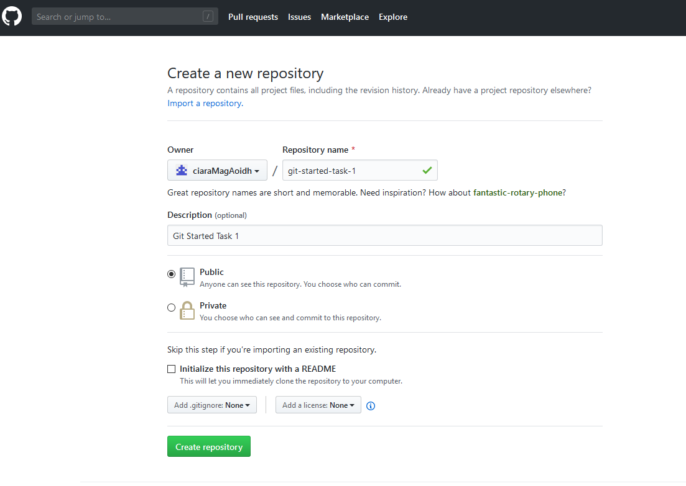
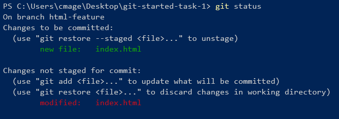
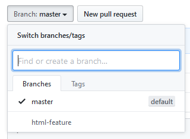

# Task 1

## Creating your own project on github :octocat:
<br>

### Create a new repository on GitHub for this task
 
 

<br>

### Creating a local repository using the terminal (mac) / command prompt (windows)
I am putting all of project folders on the Desktop for this workshop, but you can use whatever folder you like.
(Hit the Enter key to execute each command)
* Change directory to Desktop: ```cd Desktop```
* Make a new directory for this task: ```mkdir git-started-task-1```
* Change directory to the new directory you created in the previous step: ```cd git-started-task-1```
* Initialise this directory as a git repository: ```git init```
* Create a README.md file: ```echo "# Git Started: Task 1" >> README.md```
* Add the README.md file. This tells Git that we want this file to be considered for a commit. ```git add README.md```
* Commit the README.md file: ```git commit -m "First commit of the README``` The ```-m``` tells Git that we are including a commit message with this command.
* Add a remote origin to your local repository: ```git remote add origin https://github.com/YOUR_GITHUB_USERNAME/NAME__OF_REPOSITORY_CREATED__EARLIER.git```
* Push to the repository and setup up the origin as the master branch: ```git push -u origin master```

You may be asked to enter your git hub credentials at this point.

#### Awesome you have just pushed your first commit to your repository! :tada:

<br>
<br>

### Creating a feature branch for HTML
We will be creating a landing page using HTML and CSS. In terminal/command prompt - while we are still in our project directory, you can type ```git branch``` to see all of the branches in our repository. At this point when we type ```git branch``` the only branch we should see is master.

We are going to create a new branch for our HTML feature. When we are content with our HTML, we will merge the html feature branch into the master branch.

* Checkout a new branch: ```git checkout -b html-feature```. We use ```git checkout``` to switch between branches. ```-b``` tells git to create a new branch at the same  time. If you ```git branch``` you will see two branches. 
 
 
 <br>
 
 * Open your project in your editor. Create a new file and give it the name ```index.html```.
 * Add the following HTML - change the text to make it your own personal landing page. Save the file.
 
 ```html
<!DOCTYPE html>
<html lang="en">
<head>
    <meta charset="UTF-8">
    <title>Task 1</title>
</head>
<body>
    <div>
        <h1>Ciara's Landing Page For Task 1</h1>
        <h2>Here's some stuff about me</h2>
        <ul>
            <li>Computer Science in QUB</li>
            <li>Advocate for education in tech<li>
            <li>Make nice cheesecakes</li>
        </ul>
        <h2>Here's some stuff I do</h2>
        <ul>
            <li><a href="https://ssdtutor.com/"> Software Systems Development and Digital Technology Tutor</a></li>
            <li>Coffee&Code Organiser</li>
            <li>Code first girls instructor - web development and python courses</li>
            <li>Make nice cheesecakes</li>
        </ul>
        <h3>Twitter: <a href="https://twitter.com/ciara_magee_">@ciara_magee_</a></h3>
    </div>
</body>
</html>
```

* In terminal/command prompt type ```git status```. You might see something like this:
 
 
 <br>

* We have changes that have not been staged for commit - git isn't considering the changes we've just made for a commit.
* ```git add index.html```
* ```git commit -m "created index.html file"```
* We have now committed our html file, but the html branch is only on our local repository and not the remote repository. We want to tell the remote repository about our feature branch.
*  ```git push --set-upstream origin html-feature```
* ```git push``` will push our branch to the repo on gihub
 
 
 
 <br>
 
 * Now checkout the master branch ```git checkout master```. We can no longer see the html file in our editor becuase it does not exist in this branch. We are going to merge the ```html-feature``` branch into the master branch.
 * Make sure you are in the master branch with ```git status```
 * The command to merge a branch into the current branch is ```git merge BRANCH_NAME ```
 * Can you merge the html-feature branch into the master branch?
 
 <br>
 
* Only our local repository know about the merge, we want  the repository to know as well.
* Can you check to see if the merge has been staged for a commit. If not, add it and commit if necessary.
* Can you update the remote repository with our local changes.


<br>
<br>

---------

## Create a CSS feature branch
* Using the same steps to create our  ```html-feature``` branch, can you create a ```css-feature``` branch.
* Give your CSS file the name ```style.css```
* Here is the CSS I used in my sample landing page

```css
html {
	margin: 0;
	padding: 0;
	border: 0;
	font-size: 100%;
	font: inherit;
	vertical-align: baseline;
    box-sizing: border-box;

}

*, *:before, *:after {
    box-sizing: inherit;
}

body {
    padding-top: 3.5em;
    font-family: 'Open Sans', sans-serif;
    line-height: 1.85em;
    color: #888;
    font-weight: 300;
    font-size: 13pt;
}

a {
    -moz-transition: color .2s ease-in-out;
    -webkit-transition: color .2s ease-in-out;
    -ms-transition: color .2s ease-in-out;
    transition: color .2s ease-in-out;
    color: #43B3E0;
    text-decoration: underline;
}

a:hover {
    color: #43bff0 !important;
}

h1, h2, h3, h4, h5, h6 {
    color: #3e3e3e;
    margin: 0 0 0.75em 0;
    font-weight: 700;

}

h1 a, h2 a, h3 a, h4 a, h5 a, h6 a {
    color: inherit;
}

ul {
    padding: 1em 0.5em 0 0.5em;
}

ul li {
    margin: 0.5em 0.5em 0.5em 0.5em;
}

ul li a {
    top: 0 !important;
    color: inherit;
}

```

* Add and commit your changes to the ```css-feature branch```
* Open the ```index.html``` in a browser. It looks like we've forgotten to link our stylesheet to out html file. Let's do that now!
* Inside the ```<head>``` tag, add this link tag:
 ```html
  <link rel="stylesheet" type="text/css" href="style.css">
```
* Save the html file. Add and commit the changes.
* If we type ```git log``` in the terminal we can see the two commits that we have made to the ```css-feature``` branch.

<br>

* Can you let the remote repository know about the ```css-feature``` branch
* Can you merge the ``css-feature branch into the master branch`` (remember to ``checkout master``)


<br>

------------------------

## This is the end of Task 1
### [Task 2: More fun with Git and GitHub](task_002.md)


